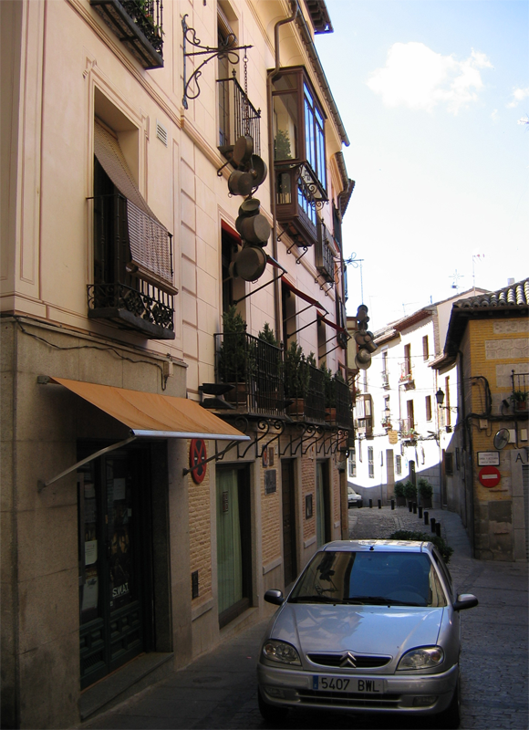
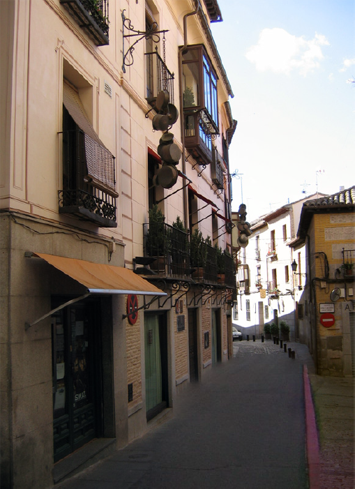
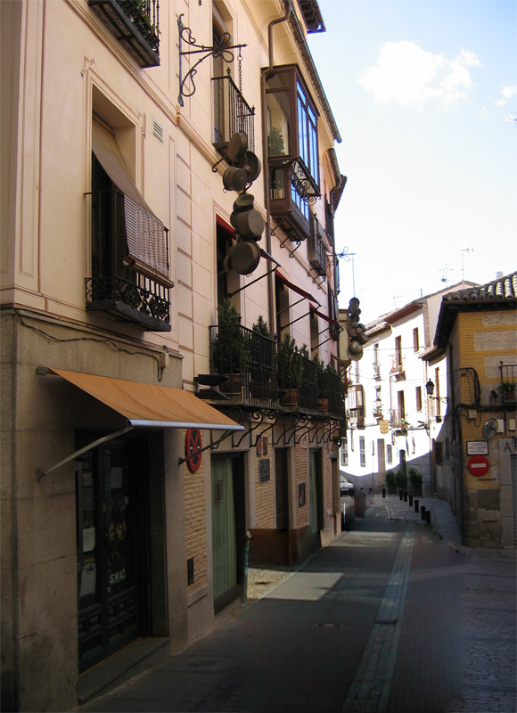

# Introduction

This project contains the results and implementation details of
a method for completing images using millions of photographs
as presented in James Hays' and Alexei Efros' SIGGRAPH 2007
<a href="http://graphics.cs.cmu.edu/projects/scene-completion/">paper</a>
"Scene Completion Using Millions of Photographs". This project
was part of the course Processing Digital Camera Images (winter term 2011/12) at
<a href="http://www.cg.tu-berlin.de/">Technical University Berlin</a>. The implementation
was done by Christian Thurow and Christopher Leiste over the course of one semester.
Our final presentation in class can be found <a href="Documentation\presentation.pdf">here</a>.
	
# Overview
	
The main goal is to replace image information in a given query image in the area defined by a mask. Be it for the sake of missing
image information or creating new versions of the input, the masked area is to be covered by another "appropriate"
image. 

Figure 1 shows one of the results we produced, for more please refer to the results section below.

Figure 2 shows the proposed algorithm
from a high level view. In order to find suitable candidates for insertion, we look up similar images in a large
pre-processed image database, but use only descriptors of the images to compare them, rather than the pixel information
themselves. Due to the massive amount of data being processed, pre-calculation of the almost 1.5M images is inevitable.

Figure 2: High Level Overview of Algorithm

Once a good match for the input image has been found, the paper suggests that the best fit is being calculated. This is done by 
altering the scale, rotation and translation of the similar image and comparing it with the input image at the mask's position.
After that the image is aligned properly we can then use a graph cut algorithm to improve 
the mask in a way that it falls into areas for which the gradients of the two images to be combined are as similar as possible. 
This will later result in a smooth transition when blending the images. Once the improved mask is available, the input image 
is merged with the candidate using Poisson blending.

# Our Contribution

From Hays et al. method we've made several improvements:
- Poisson: border pixel from input or output? ->adaptively!
- changed graph cut weighting inside mask
- GIST on color
- only GIST near mask
- distributed implementation (retrieval and search separate)
- suggestion: weighting the GISTs differently

With these improvements, we were able to achieve the following results:

<TABLE FRAME=VOID CELLSPACING=0 COLS=4 RULES=NONE BORDER=1>
<tbody>
<tr>
<td> Input Image</td>
<td> Hays result</td>
<td> Our result</td>
</tr>
</tbody>
</table>
	
# Implementation

The software was coded in C++ and extensively uses OpenCV to do image processing. To be able to run a whole set of images in a row, we added a batch script that doesn't rely on user interaction (we call this the retrieval framework). Further, as external libraries we've used: AMD, UMFPack, Eigen and graphcut - see the Dependencies folder for details on versions, etc.
	
## GIST

  
  Figure 1: 6x6 tile Layout of GIST Descriptor

Searching a database of millions of images is quite an effort. On the one hand, hundreds of gigabytes need to be read
which already takes a lot of time, depending on the medium they are saved on. Also comparing images to one another
is time-consuming. On the other hand, when looking for images, we are not interested in single pixels being similar or different.
This is the reason we use GIST to describe images for us. 
Every image's GIST descriptor is pre-calculated. This means that the image is divided into tiles and for each tile
edges of different frequencies and angular orientations are being detected and represented by a number.
When comparing two images, those numbers can be compared component-by-component and
afterwards summed up to give us a single value describing the similarity between two images. For the images in our database,
the GIST descriptors are not going to change over time. This is why it is reasonable to pre-calculate them to be able to just read them
again when they are needed.

Our GIST algorithm uses only greyscale information about the images. It doesn't care about colors.
	
Building the big database took about 49 hours on a modern CPU with 4 cores.
However, browsing the database for similarities with an input image takes only about 7 minutes.

	
## Best Fit

The original algorithm, proposed in the paper, suggests to calculate the best fit in the L*a*b color space by comparing rotated, scaled and translated versions of similar image to the query image. Although it may be a simple task, this is very computationally expensive. Depending on the dimensionality of the problem, this would add a considerably large amount to the overall processing time. We found that despite not having implemented this feature, the results are comparable to the original implementation of the papers algorithm.

## Graph Cut

Figure 2: left: Input Mask; right: Refined Mask after Graph Cut

When a candidate for blending has been found, we improve the input mask using a graph cut algorithm. The input mask already covers the areas of the input image that the user specified. But the edges of the mask are not necessarily the best seams to stitch the images. In case the gradients of both images are very different to each other, two very semantically different areas may be stitched together. In order to reduce that risk, we allow the mask to leave from its original path and find its place some pixel lengths further if that helps to make the subsequent blending appear more plausible. 

The graph we are building gets one node for each pixel that will be in the final image. Each pixel node is connected by edges to its four immediate neighbors. The weights of these edges later decide where the best cut will be. This is where we put the difference of both images' gradients combined with a cost function that assumes very low values on the original path of the mask and quickly rises for growing distance. To create a flow inside the graph, we also need sources and sinks for it. Those are placed inside the mask and on the borders of the input image so that the flow definitely goes through the border of the original mask. We experimented with the weighting function and found that an extension to the original implementation may be helpful in some cases, where we allow not only adding pixels to the mask, but also cutting out pixels from the mask if it helps minimizing the cutting costs. For calculating the minimal cut, we utilized a library implementing the <a href="http://www.csd.uwo.ca/~yuri/Papers/pami04.pdf">max-flow algorithm</a>.
	
Calculating the best cut takes about 1 minute for 15 results.
	
## Poisson Blending

In order to get convincing results, we use Poisson blending for the actual joining of the images. From our experience, once a similar image is found, this step adds the most improvement to the final result. To solve the Poisson equations we make use of the UMFPACK library. For that we adapted the implementation found <a href="http://opencv.jp/opencv2-x-samples/poisson-blending">here</a> and made several improvements to it.
	
The runtime of the Poisson blending mainly depends on the size of the final mask. 15 images are usually blended within 2 to 4 minutes.
	
# Evaluation & Results

On this page, we present our results. We picked some of the good and bad results by hand to use them for an evaluation. You also find 	many examples of the output of the test set already used in the original implementation of Scene Completion Algorithm.
	
## Good results

In many cases, the algorithm gave us beautiful results that were sometimes hard to distinguish from real photographs. Especially with natural landscapes, the seamless blending combined with the optimized mask really does its job.

	
	input

  
  mask

  

  

  

	

  

    
    input
  

  

    
    mask
  

  

    
  

  

    
  

  

    
  

  

    
    input
  

  

    
    mask
  

  

    

  

  

    

  

  

    

  

	
## Bad results
When there are problems merging images, it has mostly to do with semantic errors. Big letters in the sky, a cow on a roof, a creek of water evolving into a stone wall &ndash; the human eye knows that those thing cannot exist. But as long as no semantic validation of the results is happening, those mistakes cannot be avoided. The GIST descriptor is already able to reduce the most serious flaws by only allowing images that have similar distributions of their edges all over the canvas. But the final check if the result really makes sense still remains unsolved.
	

  

    
  

  

    
  

  

    

  

  

    

  

	
	
## Test set
To see the whole test set and results of it, see the Documentation/img/results folder.
	
# Comparison with other methods

Other methods were proposed to solve the problem of scene completion. Find below a brief purely visual comparison of the most		prominent methods available. All methods are compared by using the same input and mask, as shown in the following figure. We picked the scene completion methods of Criminisi et al., Wilczowiak et al. as well as Microsofts Smart Erase tool. We found that the most striking results are those produced by the scene completion using millions of photographs.
	

  

    
    input + mask
  

  

    
    Criminisi et al.
  

  

    
    MS Smart Erase
  

  

    	
    Wilczkowiak et al.
  

  

    
    Hays et al.
  

  

    			
    our result
  

	
## Complexity
Computing GIST descriptors

f(p) \in O(p) , p - pixels in image

Searching image database

f(i) \in O(i) , i - number of images

Graph Cut

f(m,n) \in O(m*n^2) , n - nodes, m - edges in graph, n = p, m = 2*p
-> f(p) \in O(2*p^3) , p - pixels in image

An Experimental Comparison of Min-Cut/Max-Flow Algorithms for Energy Minimization in Vision
(Yuri Boykov and Vladimir Kolmogorov)
http://www.csd.uwo.ca/~yuri/Papers/pami04.pdf

Poisson Blending

complexity of gaussian elimination: f(n) \in O(n^3) , n - matrix dimension
	our matrix dimension is: 3*(pixels in mask)
	-> f(p) \in O(3*c*p^3) , c = (mask pixels) / (image pixels) <- constant, p - image pixels

http://en.wikipedia.org/wiki/Gaussian_elimination
